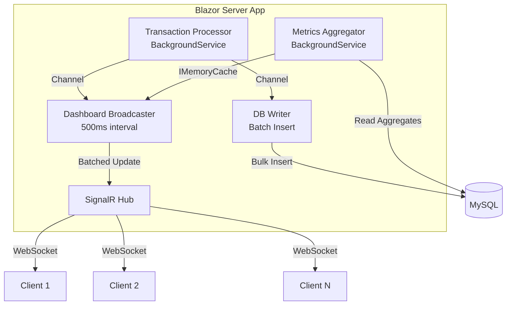

# Phase 4: Scale & Benchmark

## Objective
Stress test the application, document performance numbers, and create architecture documentation for the blog article.

## Tasks

### 4.1 Load Testing
Create a simple console app or integration test that:

```csharp
// Simulate 500 concurrent SignalR connections
// Ramp up TPS from 10 → 50 → 100
// Measure:
//   - SignalR broadcast latency (hub → all clients)
//   - Memory usage over time
//   - CPU usage
//   - DB write throughput
//   - Client-side render time (via JS performance.now())
```

Tools:
- `dotnet-counters` for runtime metrics
- `BenchmarkDotNet` for micro-benchmarks on aggregation
- Simple `Stopwatch` measurements in the broadcaster

### 4.2 Optimization Pass
Based on benchmark results, apply:

- **DB:** Batch inserts with `BulkExtensions` or raw SQL if EF is slow
- **Memory:** Object pooling for TransactionDto if GC pressure is high
- **SignalR:** MessagePack protocol if JSON serialization is bottleneck
- **Aggregation:** Sliding window with ring buffer instead of LINQ queries

### 4.3 Create Architecture Diagrams (Mermaid)

**system-overview.mmd:**


**data-pipeline.mmd** — detailed flow from transaction generation to chart render
**scaling-strategy.mmd** — what changes at 500K, 1M transactions (Redis, read replicas, SignalR backplane)

### 4.4 Document Benchmarks
Create `BENCHMARKS.md` with real numbers:

```markdown
| Metric                    | Value          | Conditions                    |
|---------------------------|----------------|-------------------------------|
| Broadcast latency         | ~XX ms         | 100 connected clients         |
| Metrics computation       | ~XX ms         | 100K transactions in DB       |
| Memory (steady state)     | ~XXX MB        | 50 TPS, 200 connections       |
| DB write throughput       | ~XXX TPS       | Batch size 100                |
| Client render (Chart.js)  | ~XX ms         | 300 data points               |
```

### 4.5 Write ARCHITECTURE.md
Full architecture document that becomes the source for the blog article:
- Problem statement (why real-time dashboards are hard)
- Architecture decisions with tradeoffs
- The batching strategy (why 500ms)
- Pre-computation vs live queries
- Channel<T> as internal bus
- Scaling paths (what we'd change for 10x)
- Lessons learned

## Definition of Done
- [ ] Load test runs and produces metrics table
- [ ] All Mermaid diagrams render correctly
- [ ] BENCHMARKS.md has real measured numbers
- [ ] ARCHITECTURE.md is comprehensive
- [ ] App runs stable for 30+ minutes under simulated load
- [ ] Git: commit on `phase/4-scale`, tag `v0.4.0`

## Estimated Time: 3-4 hours with Claude Code
